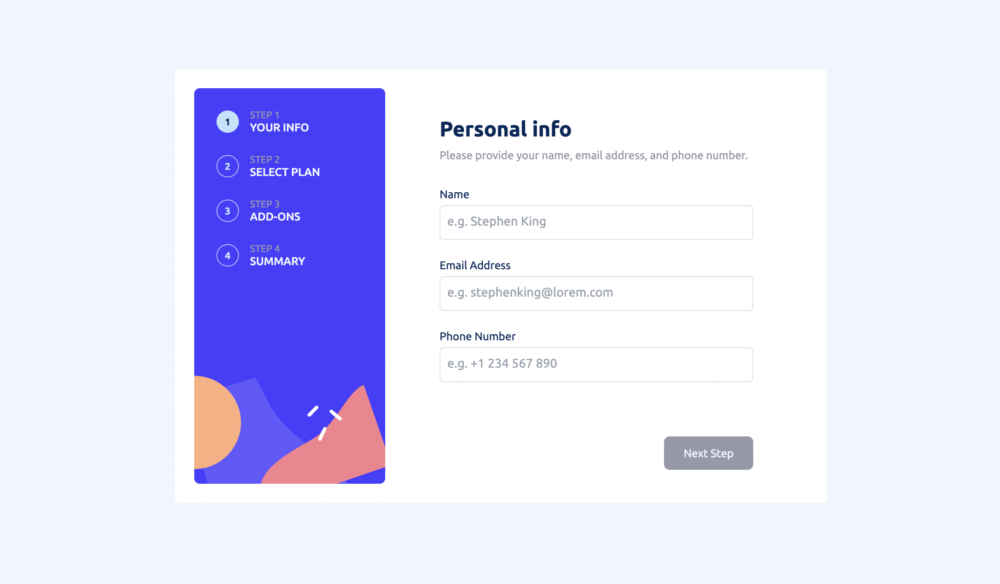

# Frontend Mentor - Multi-step form solution

This is a solution to the [Multi-step form challenge on Frontend Mentor](https://www.frontendmentor.io/challenges/multistep-form-YVAnSdqQBJ). Frontend Mentor challenges help you improve your coding skills by building realistic projects.

## Table of contents

- [Overview](#overview)
  - [The challenge](#the-challenge)
  - [Screenshots](#screenshots)
  - [Links](#links)
- [My process](#my-process)
  - [Built with](#built-with)
  - [What I learned](#what-i-learned)
  - [Continued development](#continued-development)
- [Author](#author)

## Overview

### The challenge

Users should be able to:

- Complete each step of the sequence
- See a summary of their selections on the final step and confirm their order
- View the optimal layout for the interface depending on their device's screen size
- See hover and focus states for all interactive elements on the page

### Screenshots




### Links

- Solution URL: [https://github.com/Gw3i/fm-multistep-form](https://github.com/Gw3i/fm-multistep-form)
- Live Site URL: [https://fm-multistep-form.vercel.app/](https://fm-multistep-form.vercel.app/)

## My process

1. Set up project with Angular CLI (Angular 14+)
2. Install Tailwind and set up `tailwind.config``
3. Write basic HTML for content structure
4. Connect HTML form with Angular Forms
5. Position content with Flex/Grid
6. Add Stepper Component to navigate between form sections and add navigation
7. Style each form section
8. Add switch between monthly and yearly billing periods and render content accordingly
9. Calculate total for monthly and yearly selection
10. Add validation

### Built with

- Semantic HTML5 markup
- CSS/SCSS
- Flexbox
- CSS Grid
- Mobile-first workflow
- [Angular](https://angular.io/) - JS Framework
- [Tailwind](https://tailwindcss.com/) - For styles

### What I learned

I' learned a lot how to style checkbox & radio inputs in a new way, which is not as easy as I thought.
And how to create a form in Angular and navigate between form sections.

```html
<div class="hidden xl:block">
  <p class="text-sm text-neutral-cool-gray -mb-[0.25rem]">STEP {{ step }}</p>
  <p class="font-medium text-neutral-magnolia">
    {{ step === 1 ? "YOUR INFO" : step === 2 ? "SELECT PLAN" : step === 3 ?
    "ADD-ONS" : "SUMMARY" }}
  </p>
</div>
```

```scss
.checkbox-box input[type="checkbox"]:checked ~ div,
.checkbox-box input[type="radio"]:checked ~ div {
  background-color: hsl(231, 100%, 99%);
  border: 0.063rem solid hsl(243, 100%, 62%);
  border-radius: 0.5rem;
  transition: none;
}
```

```js
changePage(isNextPage: boolean) {
    const addOns =
      (this.form.get('onlineService')?.value && this.onlineService) +
      (this.form.get('storage')?.value && this.storage) +
      (this.form.get('customProfile')?.value && this.customProfile);

    if (!isNextPage) {
      return this.currentStep--;
    } else {
      if (this.currentStep === 3) {
        if (this.form.get('plan')?.value === 'arcadePlan') {
          this.total = this.arcadePlan + addOns;
        } else if (this.form.get('plan')?.value === 'advanced') {
          this.total = this.advancedPlan + addOns;
        } else {
          this.total = this.proPlan + addOns;
        }
      }
      return this.currentStep++;
    }
  }
```

### Continued development

In the future, I'll focus more on how to write clean code in Angular and get more comfortable with it. Practice, practice, practice ⚡️💪

## Author

- Github - [Gw3i](https://github.com/Gw3i)
- Frontend Mentor - [@Gw3i](https://www.frontendmentor.io/profile/Gw3i)
